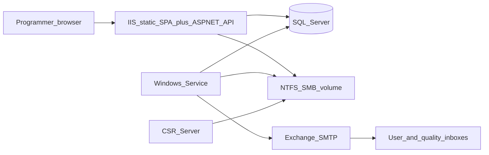

# Architecture (plant)

**Constraint:** production runs on **Windows Server + IIS** inside the Spirit manufacturing plant. CSR_Server is on the same network. Users must receive email. There is no Google Workspace and no public cloud as system of record.

Detailed decisions: [`../adr/`](../adr/).

## Chosen stack

| Layer | Choice | Why |
|-------|--------|-----|
| Web | React + TypeScript SPA, **static files on IIS** | Familiar UI; Node is a **build** tool, not a plant runtime |
| API | ASP.NET Core LTS under the same IIS site (`/api`) | Native IIS, Windows Auth later, large uploads |
| DB | SQL Server | Plant DBA default; backups; not a new engine to approve |
| Files | NTFS + SMB | CSR_Server is a folder agent; CATParts stay off-row |
| Worker | Windows Service | Survives IIS app-pool recycle |
| Email | Exchange / SMTP relay | Users already have Outlook; no SaaS mail |

## Rejected for production hosts

- Node/Next.js **runtime** on the plant server
- PostgreSQL as a new plant service
- MinIO / S3 / Google Drive as the job store
- SendGrid / Gmail as the only mail path
- In-request polling (`setTimeout` on Cloud Run / IIS)

## Runtime diagram

## Data model (logical)

- `User` — demo login now; `WindowsSid` / UPN later
- `Job` — projectName, status, overallResult, notifyEmails, noVisualExclusions
- `JobEvent` — state audit
- `Artifact` — kind, relative path, original name, size, sha256
- `Annotation` — caption, sortOrder, artifactId
- `CheckResult` — probe / drill / trim
- `EmailMessage` — eventKey, recipients, status, error, attempts

Files are not stored as `varbinary`.

## Developer machines (not plant)

SQL Server in Docker or LocalDB, a local folder instead of SMB, Papercut/Mailhog instead of Exchange. Shims only.
